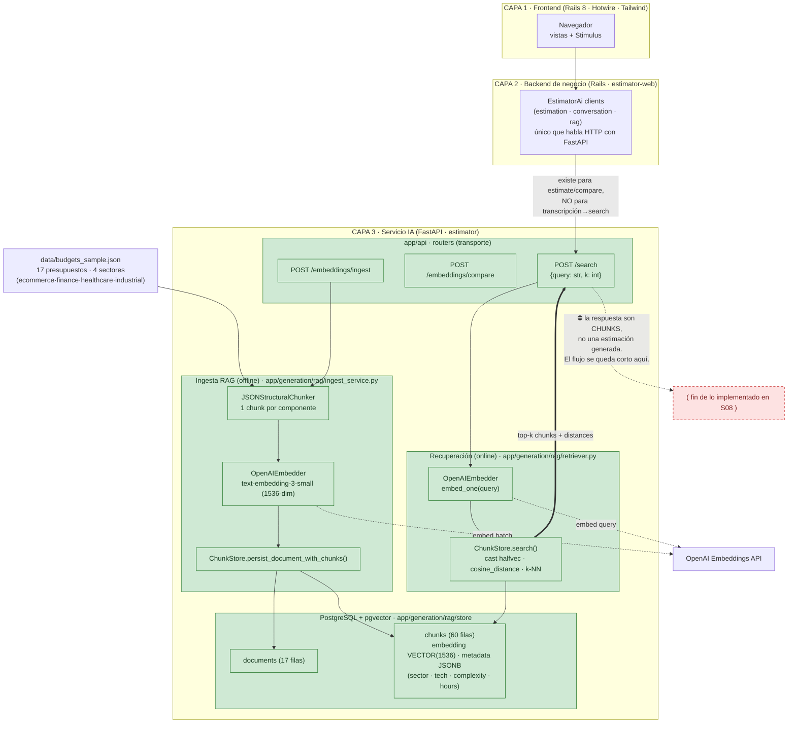
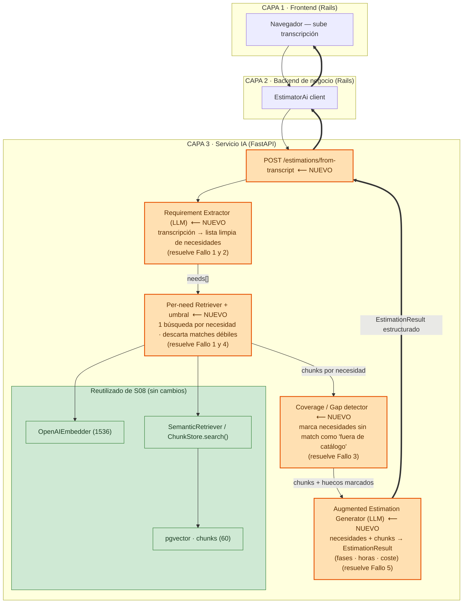

# Diagnóstico arquitectónico — Sesión 09 (pre-work)

> Observaciones en español; comandos, payloads y nombres de campo en inglés.

---

## 1. Diagrama de la arquitectura actual

Las tres capas del proyecto al cierre de **Sesión 08**. El servicio IA está bajado un nivel para
mostrar los módulos que existen hoy. La zona **sombreada** marca **hasta dónde llega lo
implementado**: el flujo RAG termina devolviendo *chunks* recuperados — no hay ninguna pieza que
los convierta en una estimación. Una transcripción cruda solo puede entrar como `query` de texto
libre en `POST /search`, y lo que sale son trozos de presupuestos históricos, no un presupuesto
nuevo.



**Cómo leer el diagrama.** El corpus semilla (17 presupuestos) se chunkéa por componente,
se embebe con `text-embedding-3-small` y se persiste en `chunks.embedding` (pgvector,
`VECTOR(1536)`). En consulta, `POST /search` embebe el texto de la query y hace k-NN por distancia
coseno (con `cast` a `halfvec`) sobre esos chunks. **La frontera roja** marca el final del flujo
actual: el sistema sabe *recuperar* presupuestos parecidos, pero **no sabe generar** uno nuevo a
partir de ellos. Una transcripción solo puede colarse como `query` de texto libre; nada la
descompone, la limpia, ni transforma los chunks recuperados en una estimación fundamentada.

---

## 2. Trace anotado de `02_ambiguous.txt`

La transcripción es la reunión con **Rubén Castaño (Casa Castaño, tienda gourmet)**. En texto
plano pide cinco cosas: **(a)** vender por internet, **(b)** un club de fidelización / puntos,
**(c)** un panel de control para ver pedidos y stock, **(d)** pago con tarjeta y **(e)** un email
de confirmación al comprar — todo envuelto en mucho ruido conversacional (su mujer, un primo en
Francia, el cuaderno donde lleva el stock).

El trace se ejecuta con un único script cliente, [`estimator/scripts/s09_trace.py`](estimator/scripts/s09_trace.py),
porque **no existe un endpoint que devuelva el vector** (ver §3, Fallo 5):

```bash
cd estimator
uv run --with openai python scripts/s09_trace.py
```

### Paso 1 — Embeber la transcripción completa

El script embebe el texto íntegro con el mismo modelo que usa el servicio (`text-embedding-3-small`):

```python
client.embeddings.create(model="text-embedding-3-small", input=<full transcript>)
```

Salida real:

```
model:        text-embedding-3-small
dimension:    1536
L2 norm:      1.000126          # OpenAI devuelve vectores normalizados → cos_dist = 1 - cos_sim
prompt_tokens: 890              # 2853 chars / ~506 palabras
first 3:      [0.00707244873046875, 0.025726318359375, -0.02978515625]
last 3:       [-0.0052947998046875, 0.03277587890625, 0.020050048828125]
```

**Comentario.** Es **un único vector de 1536 dimensiones que promedia las cinco necesidades más
todo el ruido** de la conversación. No representa "lo que Rubén quiere"; representa el centroide
semántico de un texto de 890 tokens donde "vender por internet" pesa lo mismo que "mi mujer me dice
que parezco del siglo pasado". Comprimir cinco intenciones heterogéneas en un solo punto es el
origen de casi todo lo que falla después.

### Paso 2 — Búsqueda semántica (top-5)

`POST /search` recibe la **transcripción cruda como `query`** (así expone S08 la recuperación; el
endpoint la re-embebe por dentro) y devuelve los 5 chunks más cercanos por distancia coseno:

```bash
curl -s -X POST http://localhost:8000/search \
  -H "Content-Type: application/json" \
  -d '{"query": "<full transcript of 02_ambiguous.txt>", "k": 5}'
```

Respuesta cruda (resumida a los campos clave; JSON completo en la salida del script):

```json
{
  "k": 5,
  "search_time_ms": 1394,
  "results": [
    {"chunk_id": 16, "document_id": 5, "distance": 0.6104776895012778,
     "content": "[Project: Headless e-commerce storefront ...] Component: Product catalog API ...",
     "metadata": {"budget_id": "BUD-2024-005", "client_sector": "ecommerce", "main_technology": "node", "complexity": "medium", "estimated_hours": 150}},
    {"chunk_id": 17, "document_id": 5, "distance": 0.6158526124466379,
     "content": "[Project: Headless e-commerce storefront ...] Component: Cart and checkout service ...",
     "metadata": {"budget_id": "BUD-2024-005", "client_sector": "ecommerce", "main_technology": "node", "complexity": "high", "estimated_hours": 140}},
    {"chunk_id": 18, "document_id": 5, "distance": 0.6395842570275948,
     "content": "[Project: Headless e-commerce storefront ...] Component: Personalized recommendations ...",
     "metadata": {"budget_id": "BUD-2024-005", "client_sector": "ecommerce", "main_technology": "node", "complexity": "medium", "estimated_hours": 110}},
    {"chunk_id": 19, "document_id": 5, "distance": 0.6404789638519108,
     "content": "[Project: Headless e-commerce storefront ...] Component: Storefront PWA ...",
     "metadata": {"budget_id": "BUD-2024-005", "client_sector": "ecommerce", "main_technology": "node", "complexity": "low", "estimated_hours": 60}},
    {"chunk_id": 27, "document_id": 8, "distance": 0.6432080096527659,
     "content": "[Project: Fashion returns management and resale portal] Component: Returns portal ...",
     "metadata": {"budget_id": "BUD-2024-008", "client_sector": "ecommerce", "main_technology": "dotnet", "complexity": "medium", "estimated_hours": 140}}
  ]
}
```

**Punto de referencia.** Con una query **limpia y corta** (`"online store with shopping cart and
card payment"`) el mejor match anterior fue **dist 0.50**. Con la **transcripción cruda** el mejor
match sube a **0.61** y las cinco distancias se apiñan en una banda de **0.6105–0.6432** (amplitud
**0.033**). Embeber el texto entero **sube y aplana** las distancias: el ranking pierde poder
discriminante.

### Paso 3 — Lectura de los chunks devueltos

| # | budget_id | sector | componente | dist | ¿relevante para lo que pide Rubén? |
|---|-----------|--------|------------|------|-------------------------------------|
| 1 | BUD-2024-005 | ecommerce | Product catalog API | 0.6105 | **Parcial.** Encaja con "que vean los productos", pero GraphQL + Elasticsearch + multi-currency está sobredimensionado para una tienda gourmet. |
| 2 | BUD-2024-005 | ecommerce | Cart and checkout service | 0.6159 | **Sí.** Es el match más directo: carrito + "integra el payment provider" = su "pagar con tarjeta". |
| 3 | BUD-2024-005 | ecommerce | Personalized recommendations | 0.6396 | **No / dudoso.** Rubén nunca pidió recomendaciones; collaborative filtering es overkill aquí. |
| 4 | BUD-2024-005 | ecommerce | Storefront PWA | 0.6405 | **Parcial.** El escaparate web encaja con "vender por internet". |
| 5 | BUD-2024-008 | ecommerce | Returns portal | 0.6432 | **No.** Devoluciones / resale jamás se mencionaron; entra solo por ser ecommerce. |

**Observación honesta.** Lo bueno: **los 5 chunks son del sector correcto** (`ecommerce`) — la
recuperación no se desvía a finance/healthcare. Lo malo es más interesante:

- **4 de los 5 chunks son del mismo presupuesto (BUD-2024-005).** La búsqueda recupera *un
  proyecto entero*, no la mejor pieza para cada necesidad. El vector promediado cae cerca de un
  único cluster y arrastra sus componentes.
- **Necesidades explícitas que NO se recuperaron pese a existir en el corpus**: el **panel de
  control** (había "Merchant dashboard" en BUD-003 y "Admin page" en BUD-017) y el **email de
  confirmación** (había "Order email" en BUD-017 y "Push and email notifications" en BUD-001). El
  promediado las diluyó por debajo del top-5.
- **El club de fidelización no aparece — porque no existe ningún chunk de loyalty en los 17
  presupuestos.** Una estimación generada sobre estos chunks omitiría por completo esa necesidad.
- **Un falso positivo** ("Returns portal") ocupa un hueco del top-5 que debería haber ido a una
  necesidad real.

Resumen: de las **5 necesidades** de Rubén, el retrieval cubre bien **2** (tienda, pago), pierde
**3** (panel, email, fidelización) y mete **1 irrelevante**. Suficiente para *parecer* que funciona,
insuficiente para fundamentar una estimación de calidad.

---

## 3. Diagnóstico: cinco fallos identificados

### Fallo 1 — Una transcripción se embebe como un único vector y recupera un proyecto, no piezas por necesidad
- **Problema observado:** 4 de los 5 chunks devueltos pertenecen al mismo presupuesto (BUD-2024-005); el panel de control y el email de confirmación, que Rubén pide explícitamente y que **sí existen** en el corpus (BUD-003/017, BUD-001/017), no entran en el top-5.
- **Causa probable:** `POST /search` embebe la transcripción entera en **un solo vector** (890 tokens promediados); ese centroide cae cerca de un único cluster (la tienda headless) y arrastra sus componentes, en vez de buscar el mejor chunk para cada necesidad por separado.
- **Propuesta de solución:** una etapa de **descomposición de la query** que parta la transcripción en necesidades discretas y haga una búsqueda por cada una, uniendo los resultados.

### Fallo 2 — El ruido conversacional contamina el embedding y degrada el ranking
- **Problema observado:** con una query limpia el mejor match estaba a **dist 0.50**; con la transcripción cruda sube a **0.61** y las cinco distancias se apiñan en una banda de **0.033** (0.6105–0.6432), perdiendo poder discriminante.
- **Causa probable:** el texto entra sin filtrar (frases como "mi mujer me dice que parezco del siglo pasado" o "un primo en Francia") y pesa lo mismo que los requisitos reales en el vector promediado.
- **Propuesta de solución:** una etapa de **extracción/normalización de requisitos** (destilar la transcripción a una lista limpia de necesidades) **antes** de embeber.

### Fallo 3 — El corpus no cubre todas las necesidades y el sistema lo silencia
- **Problema observado:** Rubén pide un **club de fidelización / puntos** como necesidad central; ninguno de los 17 presupuestos tiene un chunk de loyalty, así que el top-5 no contiene nada al respecto y una estimación generada lo **omitiría sin avisar**.
- **Causa probable:** corpus pequeño y sesgado, y un retriever que **siempre devuelve k resultados** sin señalar que una necesidad no tiene cobertura.
- **Propuesta de solución:** ampliar el corpus en las áreas faltantes y añadir una **detección de necesidades sin match** que las marque como "fuera de catálogo" en lugar de ignorarlas.

### Fallo 4 — El top-k no tiene umbral ni señal de confianza: siempre devuelve 5
- **Problema observado:** el quinto resultado es "Returns portal" (BUD-2024-008), una funcionalidad de **devoluciones que jamás se mencionó**; ocupa un hueco del top-5 a dist 0.6432, casi idéntica a los relevantes (0.6105).
- **Causa probable:** la asimetría de longitud (query de 890 tokens vs chunks de ~60–150) comprime la distancia coseno, y `/search` devuelve los k más cercanos **sin umbral de corte ni reordenación por relevancia real**.
- **Propuesta de solución:** un paso de **filtrado por umbral / reordenación** que descarte matches débiles en vez de rellenar el top-k con falsos positivos.

### Fallo 5 — No existe paso de generación: el flujo termina en chunks, no en una estimación
- **Problema observado:** la salida de `/search` son fragmentos de presupuestos históricos con sus distancias; **nada** los convierte en un presupuesto nuevo con fases, horas y coste para Casa Castaño.
- **Causa probable:** S08 implementa Query → Retrieval, pero **no Augmentation ni Generation**; no hay ninguna pieza que monte un prompt con los chunks recuperados y llame al LLM para producir un `EstimationResult` estructurado.
- **Propuesta de solución:** una etapa de **generación aumentada** que reciba las necesidades extraídas + los chunks recuperados y emita una estimación estructurada y fundamentada.

### Otros
- **No hay endpoint que devuelva el vector de un texto arbitrario.** `/embeddings/ingest` persiste y exige un `Budget`; `/search` embebe por dentro pero no expone el vector. El paso 1 del trace requirió un script cliente que llama a OpenAI directamente. No bloquea la estimación, pero complica observar el sistema.
- **Chunks de longitud muy desigual** (p. ej. BUD-2024-017 "Pay with card." vs BUD-005 con descripciones largas) compiten en el mismo espacio sin normalización, lo que añade ruido al ranking.

---

## 4. Propuesta de evolución arquitectónica

Las cajas **nuevas** (en naranja) no copian el esquema canónico: cada una responde a un fallo
concreto de la §3. Las cajas **verdes** son las piezas de S08 que se **reutilizan tal cual**
(embedder, pgvector y el retriever de `/search`). El flujo nuevo entra por un endpoint distinto y
deja `/search` intacto.



**Responsabilidades y flujo.** El **Requirement Extractor** convierte la transcripción ruidosa en
una lista limpia de necesidades discretas (`needs[]`), eliminando el promediado y el ruido. El
**Per-need Retriever** hace una búsqueda por cada necesidad reutilizando el embedder y el retriever
de S08, y aplica un umbral para no rellenar con falsos positivos. El **Gap detector** señala las
necesidades sin chunk relevante (p. ej. la fidelización) en vez de silenciarlas. El **Generator**
recibe necesidades + chunks recuperados y emite un `EstimationResult` estructurado con fases, horas
y coste. El dato que fluye es: transcripción → `needs[]` → chunks por necesidad (+ huecos) →
estimación. **La pieza más crítica y la que atacaría primero es el Requirement Extractor**: el
trace demostró que el daño nace ahí (un solo vector ruidoso pierde 3 de 5 necesidades y aplana las
distancias), y todo lo de aguas abajo —retrieval, detección de huecos y generación— hereda la
calidad de su salida; sin necesidades limpias, hasta un generador perfecto solo resumiría una
recuperación diluida.
